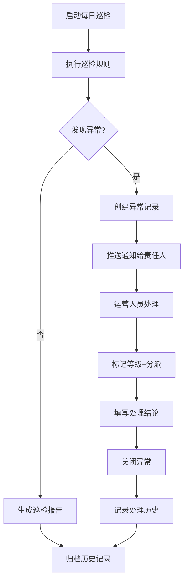

# 电商数据巡检系统 - 产品需求文档

## 1. 产品概述

电商运营团队每日数据质量保障平台，通过自动化巡检规则实时监控商品、订单和营销数据异常，支持异常标记、分派处理和历史追溯，显著提升运营团队的问题发现和处理效率。

**目标用户**：电商运营团队、数据分析人员、店铺管理员

**核心价值**：
- 每日自动化巡检，发现数据异常于萌芽阶段
- 统一管理异常处理流程，责任到人
- 保留完整历史记录，支持问题追溯和复盘

## 2. 功能模块

### 2.1 用户角色

| 角色 | 权限范围 | 核心功能 |
|------|----------|----------|
| 运营管理员 | 全部功能 | 配置巡检规则、管理用户、生成日报 |
| 运营专员 | 查看和处理异常 | 接收异常通知、处理异常、填写结论 |
| 数据分析师 | 查看数据和报告 | 查看异常趋势、下载报告 |

### 2.2 页面结构

1. **巡检首页** - 今日巡检概览、异常趋势图、快捷入口
2. **规则配置页** - 巡检规则管理和启用/停用
3. **异常列表页** - 异常数据查询、筛选、列表展示
4. **详情分析页** - 异常关联信息、商品订单详情
5. **处理记录页** - 历史处理记录、处理统计

### 2.3 核心功能清单

#### 2.3.1 巡检首页
- 今日巡检状态概览（总检查项、异常数量、处理进度）
- 异常趋势折线图（近7天/30天）
- 异常类型分布饼图
- 待处理异常卡片列表（TOP 5）
- 快捷入口：启动巡检、查看规则、处理异常
- 店铺和时间筛选器

#### 2.3.2 规则配置页
- 规则列表展示（名称、类型、阈值、状态）
- 支持的规则类型：
  - 库存为负预警
  - 价格突降预警（降幅超过X%）
  - 订单激增预警（短时间订单量超过Y）
  - 优惠叠加异常（多重优惠叠加导致价格异常）
  - 客单价异常预警
  - 退款率异常预警
- 新增/编辑规则表单（名称、类型、阈值、告警级别、启用状态）
- 规则启用/停用开关
- 规则优先级排序

#### 2.3.3 异常列表页
- 异常数据表格（异常ID、时间、类型、级别、状态、关联实体）
- 多条件筛选（店铺、时间范围、异常类型、级别、处理状态）
- 异常级别标签（严重/警告/提示）
- 批量操作（标记已读、指派处理人）
- 分页展示
- 导出功能（Excel/CSV）

#### 2.3.4 详情分析页
- 异常基本信息卡片（类型、时间、级别、状态）
- 关联商品列表（商品ID、名称、价格、库存、图片）
- 关联订单列表（订单ID、金额、数量、时间、用户）
- 异常数据详情（触发规则、阈值、实际值）
- 异常趋势迷你图
- 处理历史时间线
- 处理操作区：
  - 标记等级
  - 分派处理人（人员选择器）
  - 填写处理结论（富文本编辑器）
  - 添加处理备注
- 关联营销活动信息（如果有）

#### 2.3.5 处理记录页
- 处理记录列表（异常ID、处理人、结论、时间）
- 筛选和搜索功能
- 处理统计仪表盘：
  - 总处理数量
  - 各类型处理数量
  - 处理时效统计
  - 处理人工作量排行
- 历史巡检记录查询
- 日报生成功能

#### 2.3.6 消息订阅与提醒
- 消息订阅配置（订阅异常类型、告警级别）
- 新异常实时通知（气泡提示）
- 邮件通知配置（可选）
- 站内信系统

#### 2.3.7 报告生成
- 日报自动生成（巡检概况、异常汇总、处理进度）
- 周报/月报模板
- 报告导出（PDF、Excel）
- 自定义报告模板

## 3. 核心流程

### 3.1 日常巡检流程

### 3.2 异常处理流程

## 4. 数据统计与分析

### 4.1 核心指标
- 每日/周/月异常数量
- 异常类型分布
- 平均处理时长
- 异常解决率
- 重复异常率
- 各店铺异常排名

### 4.2 趋势分析
- 异常数量趋势图
- 处理效率趋势图
- 各类型异常占比变化
- 季节性异常预测

## 5. 技术约束

- 响应式设计，支持桌面端和移动端
- 实时数据更新（WebSocket 或轮询）
- 本地数据存储（Mock 数据）
- 无需后端服务，纯前端应用

## 6. 成功标准

- 用户能够在 3 分钟内完成首次巡检
- 异常处理流程完整率 > 95%
- 系统可用性 > 99%
- 页面加载时间 < 3 秒
