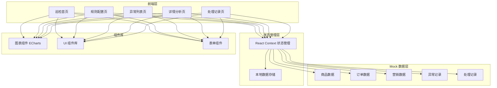

# 电商数据巡检系统 - 技术架构文档

## 1. 架构设计



## 2. 技术栈

| 技术 | 版本 | 用途 |
|------|------|------|
| React | 18.x | UI 框架 |
| React Router | 6.x | 路由管理 |
| TypeScript | 5.x | 类型安全 |
| Tailwind CSS | 3.x | 样式框架 |
| ECharts | 5.x | 数据可视化图表 |
| React Icons | 4.x | 图标库 |
| date-fns | 3.x | 日期处理 |
| Zustand | 4.x | 轻量状态管理 |
| Vite | 5.x | 构建工具 |

## 3. 路由定义

| 路由 | 页面 | 功能描述 |
|------|------|----------|
| / | 首页 | 巡检概览、趋势图、快捷入口 |
| /rules | 规则配置 | 规则列表、新增/编辑规则 |
| /anomalies | 异常列表 | 异常查询、筛选、批量操作 |
| /anomalies/:id | 详情分析 | 异常详情、关联数据、处理操作 |
| /records | 处理记录 | 历史处理记录、统计报表 |
| /reports | 报告生成 | 日报、周报生成和导出 |

## 4. 数据模型

### 4.1 巡检规则 (InspectionRule)

```typescript
interface InspectionRule {
  id: string;
  name: string;              // 规则名称
  type: RuleType;            // 规则类型
  threshold: number;         // 阈值
  unit: string;              // 单位
  level: AlertLevel;         // 告警级别
  enabled: boolean;           // 是否启用
  priority: number;          // 优先级
  description: string;       // 规则描述
  createdAt: Date;
  updatedAt: Date;
}

type RuleType = 
  | 'inventory_negative'     // 库存为负
  | 'price_drop'             // 价格突降
  | 'order_surge'            // 订单激增
  | 'coupon_stacking'        // 优惠叠加异常
  | 'unit_price_anomaly'     // 客单价异常
  | 'refund_rate_anomaly';   // 退款率异常

type AlertLevel = 'critical' | 'warning' | 'info';
```

### 4.2 异常记录 (Anomaly)

```typescript
interface Anomaly {
  id: string;
  ruleId: string;            // 关联规则
  type: RuleType;            // 异常类型
  level: AlertLevel;         // 级别
  status: AnomalyStatus;     // 状态
  title: string;             // 异常标题
  description: string;       // 异常描述
  
  // 关联信息
  shopId: string;            // 店铺ID
  productIds: string[];      // 关联商品
  orderIds: string[];        // 关联订单
  
  // 数据详情
  threshold: number;         // 阈值
  actualValue: number;        // 实际值
  deviation: number;         // 偏差
  
  // 处理信息
  assignee: string;          // 处理人
  assigneeName: string;
  resolution: string;        // 处理结论
  handledAt: Date;          // 处理时间
  
  createdAt: Date;           // 创建时间
  updatedAt: Date;
}

type AnomalyStatus = 'pending' | 'processing' | 'resolved' | 'ignored';
```

### 4.3 处理记录 (ProcessingRecord)

```typescript
interface ProcessingRecord {
  id: string;
  anomalyId: string;
  operator: string;
  operatorName: string;
  action: 'assigned' | 'level_changed' | 'resolved' | 'comment';
  previousValue: string;
  newValue: string;
  comment: string;
  createdAt: Date;
}
```

### 4.4 商品 (Product)

```typescript
interface Product {
  id: string;
  name: string;
  price: number;
  originalPrice: number;
  inventory: number;
  image: string;
  category: string;
  shopId: string;
  status: 'active' | 'inactive' | 'sold_out';
}
```

### 4.5 订单 (Order)

```typescript
interface Order {
  id: string;
  orderNo: string;
  amount: number;
  quantity: number;
  status: OrderStatus;
  userId: string;
  userName: string;
  products: OrderItem[];
  coupons: string[];
  createdAt: Date;
  paidAt: Date;
}

type OrderStatus = 'pending' | 'paid' | 'shipped' | 'delivered' | 'refunded';
```

### 4.6 店铺 (Shop)

```typescript
interface Shop {
  id: string;
  name: string;
  category: string;
  status: 'active' | 'inactive';
}
```

## 5. Mock 数据

### 5.1 数据存储方案
- 使用 localStorage 持久化存储
- Zustand 进行状态管理
- 初始化时加载预设 Mock 数据
- 支持数据的增删改查操作

### 5.2 初始化数据
- 5 个店铺
- 100+ 商品
- 500+ 订单
- 10+ 预置巡检规则
- 50+ 历史异常记录
- 20+ 处理记录

## 6. 组件结构

```
src/
├── components/
│   ├── layout/
│   │   ├── Sidebar.tsx
│   │   ├── Header.tsx
│   │   └── Layout.tsx
│   ├── charts/
│   │   ├── TrendChart.tsx
│   │   ├── PieChart.tsx
│   │   └── MiniChart.tsx
│   ├── anomaly/
│   │   ├── AnomalyTable.tsx
│   │   ├── AnomalyCard.tsx
│   │   └── AnomalyDetail.tsx
│   ├── rules/
│   │   ├── RuleList.tsx
│   │   ├── RuleForm.tsx
│   │   └── RuleItem.tsx
│   └── common/
│       ├── Filter.tsx
│       ├── Modal.tsx
│       ├── Badge.tsx
│       └── Pagination.tsx
├── pages/
│   ├── Dashboard.tsx
│   ├── Rules.tsx
│   ├── Anomalies.tsx
│   ├── AnomalyDetail.tsx
│   ├── Records.tsx
│   └── Reports.tsx
├── store/
│   ├── anomalyStore.ts
│   ├── ruleStore.ts
│   └── appStore.ts
├── data/
│   └── mockData.ts
├── types/
│   └── index.ts
└── utils/
    └── helpers.ts
```

## 7. 关键实现

### 7.1 巡检模拟
- 根据配置的规则生成模拟异常
- 支持手动触发巡检
- 自动关联商品和订单数据

### 7.2 图表集成
- 使用 ECharts 渲染趋势图和饼图
- 支持图表自适应
- 交互式数据展示

### 7.3 筛选和搜索
- 多维度筛选（店铺、时间、类型、级别、状态）
- 模糊搜索
- 组合筛选条件

### 7.4 报告生成
- 基于模板生成日报内容
- 支持导出为文本/HTML
- 自动汇总统计数据
